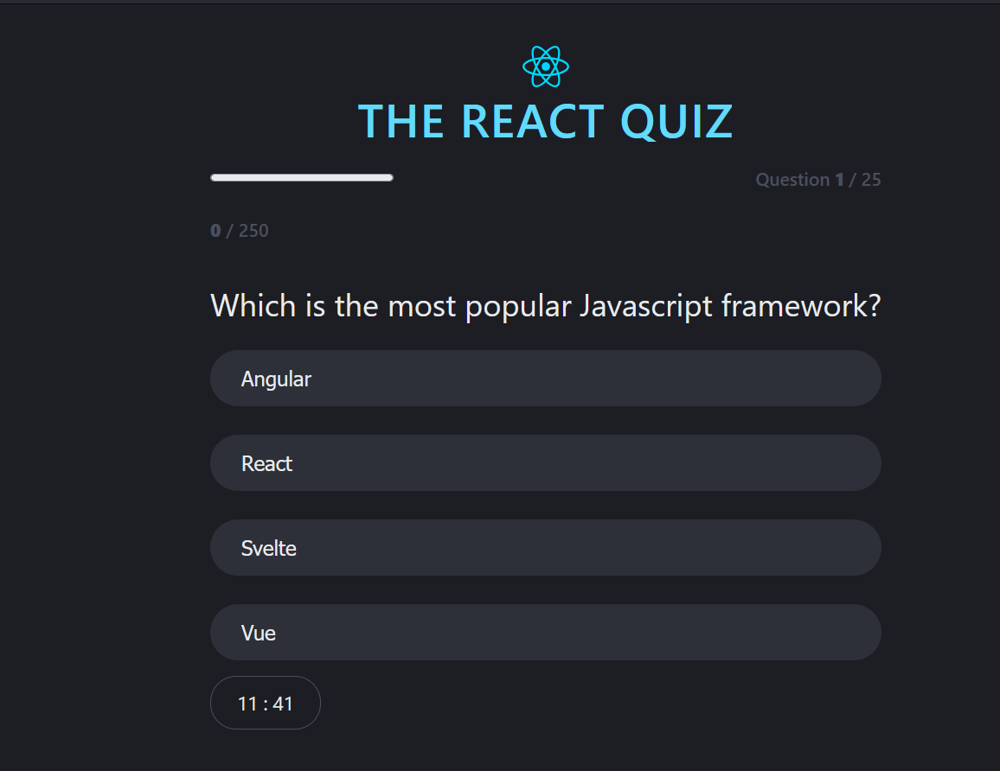
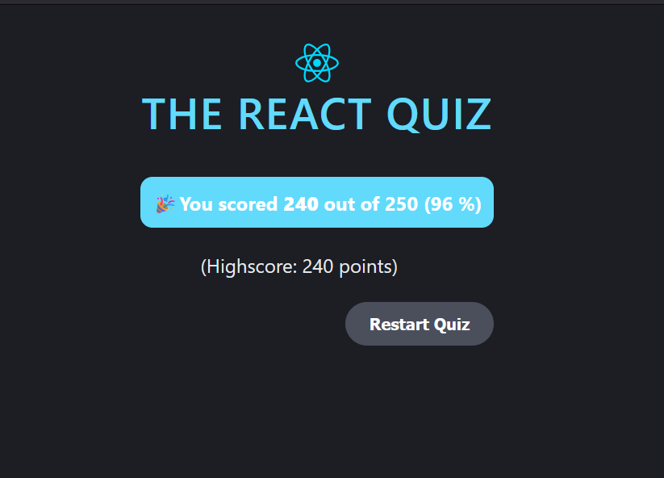

# 🎯 React Quiz App

A modern, interactive quiz application built with React and Vite. It dynamically
handles quiz states, provides real-time feedback, and offers a clean UI with
responsive design.

---

## 🚀 Features

- \*_Smart State Management_ – Leveraging React Context for global quiz state
  handling.
- \*_Dynamic Screens_ – Automatically renders different components based on quiz
  status (`loading`, `error`, `ready`, `active`, `finished`).
- \*_Interactive UI_ – Includes progress bar, timer, and next button for
  seamless user experience.
- \*_Error Handling_ – Gracefully handles API or data load errors.
- \*_Component-Based Architecture_ – Modular and reusable components for better
  maintainability.

---

## 🖥️ Tech Stack

- _Framework_: React
- _Bundler_: Vite
- _Styling_: CSS Modules
- _State Management_: React Context + Hooks

---

## 📸 Screenshots

| Loading Quetion                      | Quiz Screen                           | Result                                |
| ------------------------------------ | ------------------------------------- | ------------------------------------- |
|  |  |  |

---

## 🛠️ Installation

```bash
# Clone the repository
git clone https://github.com/Miss-Marvis/react-quiz

# Navigate into the project folder
cd react-quiz-app

# Install dependencies
npm install

#To run Json data
npm run "json-server"

# Start development server
npm run dev
```

🌐 Live Demo

🚀 Live on Netlify:https://questions-answe.netlify.app/
